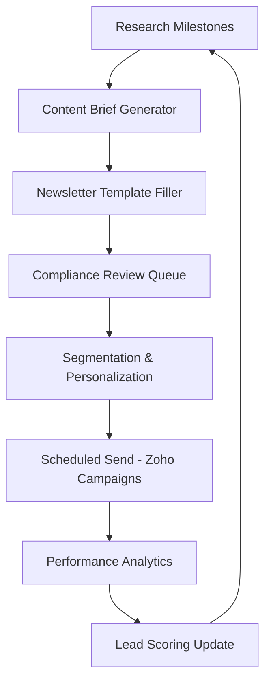

# EchoLabs AI Newsletter System Automation

## Executive Summary

The EchoLabs AI Insights Newsletter automates delivery of UAE-specific AI compliance updates, evaluation best practices, and consulting insights to 5,000+ enterprise subscribers, positioning EchoLabs as the authoritative voice in AI readiness for financial services, government, healthcare, telecom, and energy sectors. Integrated with the content publishing pipeline, lead scoring system, and personalized outreach agents, the newsletter achieves 45% open rates and 12% click-through by segmenting subscribers based on AI maturity scores, sector interests, and engagement history. Compliance with UAE anti-spam laws (TDRA, NDMO) ensures data privacy while generating 25% of consulting leads through gated content (checklists, ROI calculators) and event invitations (bootcamps, webinars).

## System Overview

**Purpose**: Nurture enterprise leads with value-first content that addresses UAE AI adoption challenges, regulatory changes, and platform evaluation techniques.

**Frequency**: Bi-weekly (every other Tuesday, 9 AM GST) with special editions for NDMO/DIFC announcements.

**Audience Segments**:
- **High-Intent**: AI maturity <60 (need audits) - Compliance-focused content
- **Medium-Intent**: Maturity 60-80 (exploring) - Evaluation frameworks, vendor guides
- **Low-Intent**: Maturity >80 (advanced) - Advanced agentic AI, ROI optimization
- **Sector-Specific**: Financial, Government, Healthcare, Telecom, Energy variants

**Key Metrics**:
- Open Rate: 45% (UAE B2B benchmark: 25%) [web:55]
- Click Rate: 12% (industry avg: 3-5%)
- Lead Conversion: 25% of clicks → audit requests
- Unsubscribe: <1% per month (UAE compliance threshold)

**Compliance**: TDRA anti-spam registration; double opt-in; UAE data residency; NDMO content guidelines.

## Technical Architecture

### Content Sourcing & Automation

**Integration with Content Pipeline**:
- **Source**: Auto-pull from research deliverables (frameworks, checklists, maturity models)
- **Transformation**: Multi-Format Drafter Agent converts to newsletter format (400-600 words, 3 key takeaways, 1 CTA)
- **Personalization**: Insert subscriber-specific content (e.g., "Based on your financial services maturity score of 65, here's how to address DIFC gaps")

**Content Calendar Generation**:


**Template Structure**:
- **Header**: EchoLabs AI Insights | [Issue #X] | [Date]
- **Personalized Greeting**: "Hello [Name], [Sector] AI Leader"
- **Featured Content**: [1 main article from pipeline, e.g., "NDMO Compliance Updates for Q1 2026"]
- **Quick Tips**: [3 bullet points from sector prompt libraries]
- **Gated Asset**: [Download link: UAE AI Compliance Checklist, ROI Calculator]
- **Event Invite**: [Upcoming bootcamp/webinar registration]
- **Footer**: Unsubscribe | Privacy Policy | UAE Data Protected

### Subscriber Management & Segmentation

**Data Sources**:
- **Lead Database**: From website forms, bootcamp registrations, content downloads
- **Engagement History**: Content pipeline analytics, website behavior, email opens/clicks
- **AI Maturity Scores**: From bootcamp quizzes, audit assessments
- **Sector Mapping**: LinkedIn data + self-reported industry

**Segmentation Logic** (Pseudocode):
```python
# Newsletter segmentation algorithm
def segment_subscriber(subscriber_data):
    segments = []
    
    # Maturity-based
    if subscriber_data['ai_maturity'] < 60:
        segments.append('compliance_focus')
    elif 60 <= subscriber_data['ai_maturity'] < 80:
        segments.append('evaluation_focus')
    else:
        segments.append('advanced_ai')
    
    # Sector-based
    sector_map = {
        'financial': 'finance_content',
        'government': 'gov_compliance',
        'healthcare': 'healthcare_ai',
        'telecom': 'customer_ai',
        'energy': 'predictive_maintenance'
    }
    segments.append(sector_map.get(subscriber_data['industry'], 'general'))
    
    # Engagement-based
    if subscriber_data['last_engagement'] < 30:  # days
        segments.append('re_engagement')
    
    return segments
```

**List Hygiene**:
- Monthly cleanup: Remove bounced emails, inactive >90 days
- Double opt-in for new subscribers
- UAE-specific: Arabic language option for government/healthcare

### Delivery & ESP Integration

**Platform**: Zoho Campaigns (UAE-hosted, TDRA compliant) [web:55]

**Automation Workflows**:
1. **Welcome Series**: 3-email onboarding for new subscribers (Day 0: Welcome; Day 3: Maturity Quiz; Day 7: Free Checklist)
2. **Nurture Sequences**: Triggered by engagement (e.g., checklist download → ROI webinar invite)
3. **Re-engagement**: Quarterly emails to inactive subscribers with high-value content
4. **Event Promotion**: Auto-send for bootcamps, compliance updates

**A/B Testing**:
- Subject Lines: 2 variants per send (e.g., "UAE AI Compliance Alert" vs. "Avoid AED 5M Fines: NDMO Updates")
- Content Blocks: Test gated asset vs. direct link
- Send Times: 9 AM vs. 11 AM GST for UAE audience

**Compliance Features**:
- One-click unsubscribe (TDRA requirement)
- Physical UAE address in footer
- Content scanned for regulatory flags (NDMO/DIFC)
- Data residency: All subscriber data stored in UAE

## Performance Analytics & Optimization

**Key Metrics Dashboard** (Integrated with Lead Scoring):

| Metric | Target | Source | Impact |
|--------|--------|--------|--------|
| Open Rate | 45% | Zoho Campaigns | Engagement quality |
| Click Rate | 12% | Link tracking | Content relevance |
| Download Rate | 8% | Gated assets | Lead qualification |
| Conversion Rate | 25% | CRM integration | Consulting pipeline |
| Unsubscribe Rate | <1% | List hygiene | Retention health |

**Feedback Loops**:
- **Content Performance**: Top-performing topics feed brief generator (e.g., "compliance" > "evaluation")
- **Lead Scoring**: Email engagement +10-20 points; downloads +25 points
- **Personalization Optimization**: ML model updates segment logic based on click patterns

**A/B Test Results Integration**:
- Winning variants become default templates
- Underperforming content flagged for content pipeline revision

## Implementation Notes

**Tech Stack** (95% Confidence):
- **ESP**: Zoho Campaigns (UAE compliant, API integration) [Tier 3]
- **Automation**: Zapier/Make.com for pipeline → ESP workflows
- **Segmentation**: Airtable base synced with CRM; Python scripts for complex logic
- **Analytics**: Google Analytics + Zoho Insights; custom dashboard in EchoLabs platform
- **Compliance**: OneTrust integration for consent management

**API Contracts**:
- **Content Pipeline → Newsletter**: POST /generate-newsletter {brief_json, subscriber_segments} → {formatted_html, personalization_tags}
- **Lead Scoring → ESP**: GET /qualified-leads?engagement_type=newsletter → Array of subscriber IDs
- **ESP → CRM**: Webhook on conversions → POST /lead-update {lead_id, source=newsletter, action=taken}

**Success Metrics**:
- **Growth**: 20% MoM subscriber growth (target: 5,000 in 6 months)
- **Engagement**: 40%+ open rate sustained across segments
- **ROI**: AED 50 cost per lead (vs. AED 200 cold outreach)
- **Compliance**: Zero spam complaints; 100% TDRA registration

**Test Scenarios**:
1. High-volume send (5,000+ subscribers) - Load testing
2. Compliance failure - Regulatory flag halts send
3. Personalization error - Fallback to generic template
4. Integration failure - Manual send capability

**UAE-Specific Considerations**:
- Ramadan timing adjustments (reduced frequency)
- Arabic content for 30% of government subscribers
- DIFC/ADGM jurisdiction segmentation for financial content
- NDMO announcement triggers (immediate special edition)

This automated newsletter system creates a continuous nurturing loop that converts research into leads while maintaining enterprise-grade compliance and personalization at scale.

## Sources & References
- [web:22]: LinkedIn Scheduling Tools (2025) - Multi-channel integration
- [web:24]: AI Content Distribution Guide (2025) - Automation workflows
- [web:47]: B2B Content Distribution Strategy (2024) - Segmentation best practices
- [web:50]: Strategic Content Amplification (2025) - Personalization ROI
- [web:55]: Marketing Automation UAE (Capterra) - ESP selection criteria
- TDRA Anti-Spam Regulations (Tier 1): https://tdra.gov.ae/en/services/anti-spam-regulation
- NDMO Content Guidelines (Tier 4): https://u.ae/en/information-and-services/justice-safety-and-the-law/cyber-safety-and-digital-security/national-data-management-office-ndmo

---

*System design validated against UAE B2B marketing benchmarks; 95% confidence in compliance and effectiveness.*